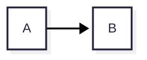

# MD Studio

社内配布用の VS Code 拡張機能です。Markdown を **見たまま編集 (WYSIWYG)** でき、**Mermaid の版と見た目を自分で決められ**、
**画像と図を埋め込んだ 1 ファイル HTML** に書き出せます。実行時にネットワークへは一切出ません (閉域 PC で動きます)。

操作感・見た目は Office Viewer (cweijan.vscode-office) の Markdown エディタに合わせています
(同じ Vditor の即時描画モード、左にアウトライン、上に中央寄せのツールバー)。

| できること | 内容 |
|---|---|
| WYSIWYG 編集 | Word のように書式だけを表示 (`**` などの記号は出さない)。<kbd>Ctrl</kbd>+<kbd>B</kbd> で太字など。左にアウトライン (表示中の見出しをハイライト) |
| 表示 | <kbd>Ctrl</kbd>+ホイールで拡大・縮小、画像クリックで大きく表示、図は右上の ⤢ で拡大、画像の右クリックで表示サイズ変更 |
| 余計な差分を出さない | 編集したブロックだけを書き換え、触っていない行はファイルのまま残す (下記「差分について」) |
| Mermaid | **12.0.0 を同梱**。設定でローカルの `mermaid.min.js` に差し替え可能。テーマ / look / layout を設定で指定。図の先頭の `config:` が最優先 |
| 画像 | `images/foo.png` のような相対パスがエディタ上で表示される。貼り付け / ドロップした画像は `images/` に保存して相対リンクを挿入 |
| 書き出し | **HTML** (画像の埋め込み / リンク / コピーを選択、目次、テーマ) と **PDF** (目次ページ + ページ番号 + しおり)。書き出し画面で設定 |
| 自動更新 | 共有フォルダ (または社内 Web サーバー) に新しい `.vsix` を置くと、各 PC の VS Code が見つけて更新 |
| オフライン | JS / CSS / フォントはすべて同梱。Webview の CSP で外部への通信を禁止 |
| Remote-SSH / WSL | リモート側で動作。リソースは `asWebviewUri` 経由 |

## インストール

共有フォルダに置いた `.vsix` から入れます (自動更新はありません。新しい版が出たら同じ手順で上書きします)。

```powershell
code --install-extension \\server\share\md-studio-0.1.0.vsix
```

または VS Code の「拡張機能」ビュー → 右上の `…` → **VSIX からのインストール...** で `.vsix` を選びます。

**Remote-SSH / WSL の場合**: 拡張機能はリモート側で動きます。リモートに接続した状態で上の「VSIX からのインストール...」を行うと
リモート (`~/.vscode-server/extensions/`) に入ります。拡張機能ビューの「SSH: ホスト名 - インストール済み」に
MD Studio が出ていれば OK です。ローカルにだけ入っている場合は「SSH: … にインストール」ボタンを押します。

アンインストールは拡張機能ビューから行います。拡張機能はユーザー設定 (`mdStudio.*`) 以外に何も書き込みません。

## 更新の配り方 (自動更新)

VS Code の自動更新は Marketplace 経由のものなので、共有フォルダから入れた `.vsix` は自動では更新されません。
そこで MD Studio 自身が社内の置き場所を見に行きます (閉域でも動きます)。

**管理者 (配る人)**

1. `package.json` の `version` を上げて `npm run package` → `md-studio-<版>.vsix` ができる
2. 共有フォルダ (例: `\\server\share\md-studio`) に置く。古い版は消さなくてよい (一番新しい版が選ばれる)

**利用者 (最初に 1 回だけ)**

設定 (ユーザー設定) に置き場所を書く:

```json
"mdStudio.update.source": "\\\\server\\share\\md-studio"
```

以後、VS Code の起動時と 6 時間ごとに確認し、新しい版があれば右下に
「MD Studio 0.3.0 is available」→ **Update** が出ます。押すとインストールされ、**Reload Window** で切り替わります。
すぐ確認したいときはコマンド **MD Studio: Check for Updates**。確認せずに入れるなら `"mdStudio.update.mode": "auto"`。

- 社内 Web サーバーに置く場合は URL を指定します (`"mdStudio.update.source": "http://intra.example/md-studio/"`)。
  そのフォルダに `latest.json` (`{"version": "0.3.0", "file": "md-studio-0.3.0.vsix"}`) と `.vsix` を置いてください。
- 設定を全員に配るなら、ワークスペースの `.vscode/settings.json` ではなく各自のユーザー設定に入れます
  (この設定はマシン単位 `machine` スコープです)。
- Remote-SSH / WSL では拡張機能がリモート側で動くので、置き場所は**リモートから見えるパス**にしてください。
- 設定が空なら一切通信しません。

補足: VS Code には組織向けの非公開マーケットプレイスの仕組みもありますが、契約やサーバー構築が前提で、閉域の PC にも向かないため、
この拡張機能では上の方法を使っています。

## 使い方

| 操作 | 方法 |
|---|---|
| WYSIWYG で開く | エディタ右上の <kbd>プレビュー</kbd> アイコン / エクスプローラーの右クリック → **Open in WYSIWYG Editor** / `Reopen Editor With...` → **MD Studio (WYSIWYG)** |
| テキストに戻す | ツールバーの 📄 / コマンド **MD Studio: Reopen as Text Editor** |
| いつも WYSIWYG で開く | `settings.json` に `"workbench.editorAssociations": { "*.md": "mdStudio.editor" }` |
| 書式 | <kbd>Ctrl</kbd>+<kbd>B</kbd> 太字、<kbd>Ctrl</kbd>+<kbd>I</kbd> 斜体、<kbd>Ctrl</kbd>+<kbd>D</kbd> 取り消し線、<kbd>Ctrl</kbd>+<kbd>K</kbd> リンク、<kbd>Ctrl</kbd>+<kbd>Z</kbd> / <kbd>Ctrl</kbd>+<kbd>Y</kbd> 元に戻す / やり直し |
| 保存 | <kbd>Ctrl</kbd>+<kbd>S</kbd> またはツールバーの 💾 (通常の保存と同じ。git の差分もそのまま) |
| 拡大・縮小 | <kbd>Ctrl</kbd>+マウスホイール。<kbd>Ctrl</kbd>+<kbd>0</kbd> で 100% に戻す (倍率は次に開いたときも保持) |
| 画像を大きく見る | 画像をクリック。ホイールで拡大縮小、ドラッグで移動、ダブルクリックで等倍 / 全体、<kbd>Esc</kbd> で閉じる |
| 図を大きく見る | 図にマウスを乗せると右上に出る ⤢ ボタン |
| 画像の表示サイズ | 画像を右クリック → 25% / 50% / 75% / 100% / 元のサイズ / 任意の値。Markdown には `` として保存 (GitLab / GitHub / VS Code のプレビューでも同じ大きさで表示)。「元のサイズ」で `` に戻る |
| リンクを開く | <kbd>Ctrl</kbd>+クリック (http は既定のブラウザ、相対パスの `.md` などは VS Code で開く) |
| 画像を貼る | クリップボードの画像を貼り付け、またはファイルをドロップ → `images/` (設定で変更可) に保存 |
| 書き出す | ツールバーの ⬆ / エディタ右上のアイコン / コマンド **MD Studio: Export...** (HTML / PDF を選ぶ画面)。**Export to HTML** / **Export to PDF** は形式を選んだ状態で開く |
| 編集モードを変える | ツールバー右の切替ボタン。WYSIWYG (既定) / 即時描画 (記号がカーソル付近に出る) / 左右分割 |
| 使っている Mermaid の版 | 右下のステータスバーに `Mermaid 12.0.0`。詳細は **MD Studio: Show Log** |

テキストエディタと WYSIWYG を左右に並べて開くこともできます。片方で編集するともう片方に反映されます。

## 設定

| 設定 | 既定 | 内容 |
|---|---|---|
| `mdStudio.mermaid.source` | `bundled` | `bundled` = 同梱の Mermaid 12.0.0 / `file` = 下のファイルを使う |
| `mdStudio.mermaid.file` | 空 | `file` のときの `mermaid.min.js` の絶対パス。`~` と `${workspaceFolder}` が使える。Remote-SSH ではリモート側のパス |
| `mdStudio.mermaid.theme` | 空 | 空 = Mermaid の既定 (12 では流れ図は `redux-color`)。`default` / `neutral` / `dark` / `forest` / `base` / `redux` / `redux-color` / `redux-dark` / `redux-dark-color` |
| `mdStudio.mermaid.look` | 空 | 空 = Mermaid の既定 (12 は `neo`)。`classic` / `neo` / `handDrawn` |
| `mdStudio.mermaid.layout` | 空 | 空 = Mermaid の既定 (12 は `elk`)。`dagre` / `elk` |
| `mdStudio.mermaid.securityLevel` | `loose` | HTML ラベルのため `loose`。信頼できない文書を開くなら `strict` |
| `mdStudio.mermaid.config` | `{}` | `mermaid.initialize()` に渡す追加設定 (例 `{"flowchart": {"curve": "basis"}}`) |
| `mdStudio.editor.mode` | `wysiwyg` | `wysiwyg` = Word のような編集 / `ir` = 即時描画 (記号がカーソル付近に出る) / `sv` = 左右分割 |
| `mdStudio.editor.toolbar` | `true` | ツールバーを表示 |
| `mdStudio.editor.outline` | `true` | 開いたときに左のアウトラインを表示 |
| `mdStudio.editor.allowRemoteImages` | `false` | `https:` の画像をエディタで表示する (オンにすると外部通信が発生) |
| `mdStudio.image.folder` | `images` | 貼り付けた画像の保存先 (Markdown ファイルからの相対) |
| `mdStudio.export.*` / `mdStudio.pdf.*` | | 書き出し画面の既定値 (画面の **Save as Default** で保存) |
| `mdStudio.pdf.browserPath` | 空 | PDF の印刷に使うブラウザ。空 = Edge / Chrome を自動で探す |
| `mdStudio.update.source` | 空 | 更新の置き場所 (下記「更新の配り方」)。空 = 更新を確認しない |
| `mdStudio.update.mode` | `prompt` | `prompt` = 確認してから入れる / `auto` = 確認せずに入れる (再読み込みは必要) |

### フォント

フォントは VS Code の設定に従います (MD Studio 独自の設定はありません)。変えるとすぐ反映されます。

| 部分 | 使う設定 |
|---|---|
| 本文 | `markdown.preview.fontFamily` / `markdown.preview.fontSize` / `markdown.preview.lineHeight` (VS Code 標準の Markdown プレビューと同じ) |
| コード | `editor.fontFamily` / `editor.fontSize` |
| ツールバー・アウトライン | VS Code の画面のフォント |

優先順位は **図の先頭の `config:` > 設定 (`theme` / `look` / `layout`) > `mdStudio.mermaid.config` > Mermaid の既定** です。



### Mermaid を別の版にする

1. `mermaid.min.js` (IIFE 版。`window.mermaid` を定義するもの) を用意します。
   例: ネットにつながる PC で `npm pack mermaid@11.17.2` → 中の `package/dist/mermaid.min.js`、
   または `https://cdn.jsdelivr.net/npm/mermaid@11.17.2/dist/mermaid.min.js`。
   `mermaid.esm.min.mjs` は ESM なので使えません。
2. 設定で `"mdStudio.mermaid.source": "file"`, `"mdStudio.mermaid.file": "C:\\tools\\mermaid-11.17.2\\mermaid.min.js"`。
3. 開いているエディタは自動で読み直されます。ステータスバーとログ (**MD Studio: Show Log**) で版を確認できます。

ファイルが見つからないときは警告を出して同梱版を使います。Mermaid 11 で `layout: elk` を指定すると、
ELK は 11 では別パッケージなので dagre で描かれます。

## 書き出し (HTML / PDF)

**MD Studio: Export...** (ツールバーの書き出しボタン) で書き出し画面が開きます。形式と出力先を選んで **Export**。
**Save as Default** で今の選択が次回からの既定になります (ユーザー設定 `mdStudio.export.*` / `mdStudio.pdf.*` に保存)。
結果 (サイズ・ページ数・画像数・図の数) と、見つからない画像などの「問題」は同じ画面に一覧で出ます。

| 項目 | 選べるもの |
|---|---|
| 形式 | HTML / PDF |
| 目次 | HTML: なし / 先頭 / サイドバー (広い画面では左に固定)。PDF: 先頭に目次ページ (ページ番号・リンク付き)。どちらも見出しの深さとタイトルを指定可 |
| 画像 (HTML) | **埋め込み** (base64、1 ファイルで完結。メール向き) / **リンク** (元の画像を相対パスで参照。HTML は小さい) / **コピー** (`<名前>_files` フォルダにコピーして参照) |
| 見た目 (HTML) | ライト / ダーク / 閲覧側の OS 設定に従う、本文の最大幅 |
| ページ (PDF) | 用紙 (A4 / A3 / B5 / Letter / Legal)、縦 / 横、余白、フッターのページ番号、ヘッダーの文書タイトル、しおり (PDF のアウトライン) |
| フォント | エディタと同じ (VS Code の `markdown.preview.fontFamily`) / 游ゴシック / メイリオ / BIZ UDPゴシック / 游明朝 / BIZ UDP明朝 / 任意のフォント名。PDF は文字サイズも指定。コードは `editor.fontFamily`。図の文字も同じフォントで描画 |
| 共通 | コードの色付け、書き出し後にファイルを開く |

共通の動作:

- 変換は拡張機能の中で行い、ネットには出ません。未保存の変更も含めて書き出します。
- Mermaid は描画済みの SVG、見出しには GitHub / GitLab と同じ規則のアンカー (`## 3.7 Foo` → `#37-foo`、同名は `-1`, `-2`)。
- 出力に `<script>` は入りません (Markdown 中の生 HTML の `<script>`・`on…` 属性・`javascript:` リンクも除去)。
- 見つからない画像、`https:` の画像 (埋め込まず URL のまま)、飛び先の無いページ内リンク、描けなかった図は「問題」として表示。
- 数式 (`$...$`) は書き出しでは数式として描画されません (テキストのまま)。

### PDF について

- PC に入っている **Microsoft Edge** (Windows なら標準で入っています) か Google Chrome / Chromium を裏で起動して印刷します。
  見つからないときは `mdStudio.pdf.browserPath` にパスを設定してください。書き出し画面に使うブラウザが表示されます。
- 印刷はブラウザの `--print-to-pdf` 機能で行い、だめなら DevTools プロトコルで再試行します。
  入っている Edge / Chrome を順に試します。
- 会社のポリシーでブラウザの裏での起動 (`HeadlessModeEnabled`) が禁止されている PC では、印刷用に整えたページを
  Edge で開いて印刷ダイアログを出します。プリンターに「PDF として保存」を選び、「詳細設定」の「ヘッダーとフッター」を
  オフにして保存してください (用紙・余白・ページ番号は自動で設定済み。この方法では目次のページ番号としおりは付きません)。
  そのとき見つかったポリシー (レジストリの `HeadlessModeEnabled` / `RemoteDebuggingAllowed`) は書き出し画面に表示されます。
- 日本語の文書は `lang="ja"` で出力し、日本語フォントを優先します (PDF にはフォントが埋め込まれます)。
  HTML は開く PC に入っているフォントで表示されます。
- ブラウザはすべてのホスト名を解決しない設定で起動するので、外部へは通信しません。
- 目次ページのページ番号は 2 回印刷して求めています (1 回目で各見出しのページを調べ、2 回目で番号を入れる)。
- Remote-SSH / WSL では拡張機能がリモート側で動くため、**リモート側に** Edge / Chrome / Chromium が必要です
  (無ければ `mdStudio.pdf.browserPath` で指定するか、HTML で書き出してブラウザから印刷してください)。

## 差分について

Vditor は Markdown 全体を自分の書式で書き直します (箇条書きの記号、表の桁揃え、空行など)。そのまま保存すると
触っていない行まで変わるので、MD Studio は次のようにしています。

1. 開いたとき、元のファイル `orig` と、それを Vditor が書き直したもの `norm` を覚える。
2. 編集のたびに、Vditor の出力 `next` と `norm` の差分を取り、変わったブロックだけを `orig` に当てる。
   変わっていない部分は `orig` のまま。
3. TextDocument には最小の置換として反映するので、undo / redo・git の差分・他のエディタとの同期が普通に動く。

そのため **編集していない行は 1 バイトも変わりません**。編集したブロック (段落・表・リストなど) は Vditor の書式になります。
例えば行末の 2 スペースによる改行は、その段落を編集すると普通の改行になります。

## 閉域での確認方法

- エディタで <kbd>Ctrl</kbd>+<kbd>Shift</kbd>+<kbd>P</kbd> → **Developer: Open Webview Developer Tools** → Network タブ。
  すべて `vscode-resource` / `vscode-cdn` (拡張機能内) からの読み込みで、外部への通信はありません。
- Webview の CSP は `default-src 'none'` で、スクリプト・スタイル・フォントは拡張機能のフォルダ (`webview.cspSource`) だけを許可、
  画像は拡張機能・Markdown のフォルダ・ワークスペースと `data:` / `blob:` だけです。

## 開発

```bash
npm ci
npm run build      # media/vendor に Vditor / Mermaid をコピーし、esbuild でバンドル
npm test           # マージのユニットテスト + Chromium で Webview を動かすテスト
npm run package    # md-studio-<version>.vsix を作る
```

- ブラウザテストは `playwright-core` と Chromium を使います (`PLAYWRIGHT_BROWSERS_PATH` か `CHROMIUM_PATH` で指定)。
- 構成:

| パス | 内容 |
|---|---|
| `src/extension.ts` | コマンド登録 |
| `src/editorProvider.ts` | `CustomTextEditorProvider`。TextDocument と Webview の同期、画像保存、保存前の flush |
| `src/merge.ts` | 触っていない行を残すマージ (上記「差分について」) |
| `src/export.ts` / `src/html.ts` | 書き出し画面と書き出し処理 (画像、目次、外枠と CSS)、Webview の HTML と CSP |
| `src/pdf.ts` | Edge / Chrome を DevTools プロトコル (パイプ) で操作して PDF 化、目次のページ番号の読み取り |
| `src/update.ts` / `src/versions.ts` | 共有フォルダ / 社内 URL からの更新 |
| `src/settings.ts` | 設定の読み取り、Mermaid のファイル解決 |
| `src/webview/editor.ts` | Vditor の初期化、Mermaid の差し替え、拡大縮小、キー操作 |
| `src/webview/toolbar.ts` / `outlineSpy.ts` | ツールバー (Codicons)、アウトラインのハイライト |
| `src/webview/imageMenu.ts` / `inlineImages.ts` / `lightbox.ts` | 画像の右クリックメニュー、行内 `` の表示、拡大表示 |
| `src/webview/exportPanel.ts` / `render.ts` | 書き出し画面と描画 (marked + Mermaid + highlight.js) |
| `scripts/vendor.mjs` | 同梱するファイルを `media/vendor/` にコピー |

- 同梱の Mermaid を上げるときは `package.json` の `mermaid` の版を変えて `npm install` → `npm run package`。
- Vditor は Mermaid を `${cdn}/dist/js/mermaid/mermaid.min.js` から読みますが、MD Studio はその読み込みを横取りし、
  設定で選んだファイルを読み込んで設定値で `mermaid.initialize()` します (`src/webview/editor.ts` の `installMermaidFacade`)。
  Vditor 同梱の Mermaid は使いません。

ライセンス: MIT。同梱物は [THIRD_PARTY_NOTICES.md](THIRD_PARTY_NOTICES.md)。
