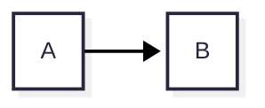

# MD Studio

社内配布用の VS Code 拡張機能です。Markdown を **見たまま編集 (WYSIWYG)** でき、**Mermaid の版と見た目を自分で決められ**、
**画像と図を埋め込んだ 1 ファイル HTML** に書き出せます。実行時にネットワークへは一切出ません (閉域 PC で動きます)。

操作感・見た目は Office Viewer (cweijan.vscode-office) の Markdown エディタに合わせています
(同じ Vditor の即時描画モード、左にアウトライン、上に中央寄せのツールバー)。

| できること | 内容 |
|---|---|
| WYSIWYG 編集 | Vditor (MIT) の即時描画モード。`.md` は既定ではテキストエディタで開き、MD Studio は「別のエディタで開く」で選ぶ |
| 余計な差分を出さない | 編集したブロックだけを書き換え、触っていない行はファイルのまま残す (下記「差分について」) |
| Mermaid | **12.0.0 を同梱**。設定でローカルの `mermaid.min.js` に差し替え可能。テーマ / look / layout を設定で指定。図の先頭の `config:` が最優先 |
| 画像 | `images/foo.png` のような相対パスがエディタ上で表示される。貼り付け / ドロップした画像は `images/` に保存して相対リンクを挿入 |
| HTML 書き出し | 画像は base64、Mermaid は描画済み SVG で埋め込み、`<script>` なし。見出しに GitHub / GitLab と同じ規則のアンカー |
| オフライン | JS / CSS / フォントはすべて同梱。Webview の CSP で外部への通信を禁止 |
| Remote-SSH / WSL | リモート側で動作。リソースは `asWebviewUri` 経由 |

## インストール

共有フォルダに置いた `.vsix` から入れます (自動更新はありません。新しい版が出たら同じ手順で上書きします)。

```powershell
code --install-extension \\server\share\md-studio-0.1.0.vsix
```

または VS Code の「拡張機能」ビュー → 右上の `…` → **VSIX からのインストール...** で `.vsix` を選びます。

**Remote-SSH / WSL の場合**: 拡張機能はリモート側で動きます。リモートに接続した状態で上の「VSIX からのインストール...」を行うと
リモート (`~/.vscode-server/extensions/`) に入ります。拡張機能ビューの「SSH: ホスト名 - インストール済み」に
MD Studio が出ていれば OK です。ローカルにだけ入っている場合は「SSH: … にインストール」ボタンを押します。

アンインストールは拡張機能ビューから行います。拡張機能はユーザー設定 (`mdStudio.*`) 以外に何も書き込みません。

## 使い方

| 操作 | 方法 |
|---|---|
| WYSIWYG で開く | エディタ右上の <kbd>プレビュー</kbd> アイコン / エクスプローラーの右クリック → **Open in WYSIWYG Editor** / `Reopen Editor With...` → **MD Studio (WYSIWYG)** |
| テキストに戻す | ツールバーの 📄 / エディタ右上のアイコン / コマンド **MD Studio: Reopen as Text Editor** |
| いつも WYSIWYG で開く | `settings.json` に `"workbench.editorAssociations": { "*.md": "mdStudio.editor" }` |
| 保存 | <kbd>Ctrl</kbd>+<kbd>S</kbd> またはツールバーの 💾 (通常の保存と同じ。undo / git もそのまま使えます) |
| リンクを開く | <kbd>Ctrl</kbd>+クリック (http は既定のブラウザ、相対パスの `.md` などは VS Code で開く) |
| 画像を貼る | クリップボードの画像を貼り付け、またはファイルをドロップ → `images/` (設定で変更可) に保存 |
| HTML に書き出す | ツールバーの ⬇ / エディタ右上のアイコン / コマンド **MD Studio: Export to Single HTML File** |
| 使っている Mermaid の版 | WYSIWYG エディタを開くと右下のステータスバーに `Mermaid 12.0.0` と出ます。詳細は **MD Studio: Show Log** |

テキストエディタと WYSIWYG を左右に並べて開くこともできます。片方で編集するともう片方に反映されます。

## 設定

| 設定 | 既定 | 内容 |
|---|---|---|
| `mdStudio.mermaid.source` | `bundled` | `bundled` = 同梱の Mermaid 12.0.0 / `file` = 下のファイルを使う |
| `mdStudio.mermaid.file` | 空 | `file` のときの `mermaid.min.js` の絶対パス。`~` と `${workspaceFolder}` が使える。Remote-SSH ではリモート側のパス |
| `mdStudio.mermaid.theme` | 空 | 空 = Mermaid の既定 (12 では流れ図は `redux-color`)。`default` / `neutral` / `dark` / `forest` / `base` / `redux` / `redux-color` / `redux-dark` / `redux-dark-color` |
| `mdStudio.mermaid.look` | 空 | 空 = Mermaid の既定 (12 は `neo`)。`classic` / `neo` / `handDrawn` |
| `mdStudio.mermaid.layout` | 空 | 空 = Mermaid の既定 (12 は `elk`)。`dagre` / `elk` |
| `mdStudio.mermaid.securityLevel` | `loose` | HTML ラベルのため `loose`。信頼できない文書を開くなら `strict` |
| `mdStudio.mermaid.config` | `{}` | `mermaid.initialize()` に渡す追加設定 (例 `{"flowchart": {"curve": "basis"}}`) |
| `mdStudio.editor.mode` | `ir` | `ir` = 即時描画 (Office Viewer と同じ) / `wysiwyg` / `sv` = 左右分割 |
| `mdStudio.editor.toolbar` | `true` | ツールバーを表示 |
| `mdStudio.editor.outline` | `true` | 開いたときに左のアウトラインを表示 |
| `mdStudio.editor.allowRemoteImages` | `false` | `https:` の画像をエディタで表示する (オンにすると外部通信が発生) |
| `mdStudio.image.folder` | `images` | 貼り付けた画像の保存先 (Markdown ファイルからの相対) |
| `mdStudio.export.maxWidth` | `1180` | 書き出した HTML の本文の最大幅 (px) |

優先順位は **図の先頭の `config:` > 設定 (`theme` / `look` / `layout`) > `mdStudio.mermaid.config` > Mermaid の既定** です。



### Mermaid を別の版にする

1. `mermaid.min.js` (IIFE 版。`window.mermaid` を定義するもの) を用意します。
   例: ネットにつながる PC で `npm pack mermaid@11.17.2` → 中の `package/dist/mermaid.min.js`、
   または `https://cdn.jsdelivr.net/npm/mermaid@11.17.2/dist/mermaid.min.js`。
   `mermaid.esm.min.mjs` は ESM なので使えません。
2. 設定で `"mdStudio.mermaid.source": "file"`, `"mdStudio.mermaid.file": "C:\\tools\\mermaid-11.17.2\\mermaid.min.js"`。
3. 開いているエディタは自動で読み直されます。ステータスバーとログ (**MD Studio: Show Log**) で版を確認できます。

ファイルが見つからないときは警告を出して同梱版を使います。Mermaid 11 で `layout: elk` を指定すると、
ELK は 11 では別パッケージなので dagre で描かれます。

## 1 ファイル HTML 書き出し

- 変換は拡張機能の中の Webview で行います (marked → 見出しにアンカー → Mermaid を SVG に → highlight.js → 画像を data URI)。
  ブラウザを別に起動したり、ネットに出たりはしません。未保存の変更も含めて書き出します。
- 出力には `<script>` を含めません (Markdown 中の生 HTML の `<script>`・`on…` 属性・`javascript:` リンクも取り除きます)。
- 見出しのアンカーは GitHub / GitLab と同じ規則 (`## 3.7 Foo` → `#37-foo`、同名は `-1`, `-2`)。
- 次のものは「問題」として通知とログ (**MD Studio: Show Log**) に出ます: 見つからない画像、`https:` の画像 (埋め込まず URL のまま)、
  飛び先の無いページ内リンク、描けなかった図。
- 数式 (`$...$`) は書き出しでは数式として描画されません (テキストのまま)。

## 差分について

Vditor は Markdown 全体を自分の書式で書き直します (箇条書きの記号、表の桁揃え、空行など)。そのまま保存すると
触っていない行まで変わるので、MD Studio は次のようにしています。

1. 開いたとき、元のファイル `orig` と、それを Vditor が書き直したもの `norm` を覚える。
2. 編集のたびに、Vditor の出力 `next` と `norm` の差分を取り、変わったブロックだけを `orig` に当てる。
   変わっていない部分は `orig` のまま。
3. TextDocument には最小の置換として反映するので、undo / redo・git の差分・他のエディタとの同期が普通に動く。

そのため **編集していない行は 1 バイトも変わりません**。編集したブロック (段落・表・リストなど) は Vditor の書式になります。
例えば行末の 2 スペースによる改行は、その段落を編集すると普通の改行になります。

## 閉域での確認方法

- エディタで <kbd>Ctrl</kbd>+<kbd>Shift</kbd>+<kbd>P</kbd> → **Developer: Open Webview Developer Tools** → Network タブ。
  すべて `vscode-resource` / `vscode-cdn` (拡張機能内) からの読み込みで、外部への通信はありません。
- Webview の CSP は `default-src 'none'` で、スクリプト・スタイル・フォントは拡張機能のフォルダ (`webview.cspSource`) だけを許可、
  画像は拡張機能・Markdown のフォルダ・ワークスペースと `data:` / `blob:` だけです。

## 開発

```bash
npm ci
npm run build      # media/vendor に Vditor / Mermaid をコピーし、esbuild でバンドル
npm test           # マージのユニットテスト + Chromium で Webview を動かすテスト
npm run package    # md-studio-<version>.vsix を作る
```

- ブラウザテストは `playwright-core` と Chromium を使います (`PLAYWRIGHT_BROWSERS_PATH` か `CHROMIUM_PATH` で指定)。
- 構成:

| パス | 内容 |
|---|---|
| `src/extension.ts` | コマンド登録 |
| `src/editorProvider.ts` | `CustomTextEditorProvider`。TextDocument と Webview の同期、画像保存、保存前の flush |
| `src/merge.ts` | 触っていない行を残すマージ (上記「差分について」) |
| `src/export.ts` / `src/html.ts` | HTML 書き出し (画像の読み込み、外枠と CSS)、Webview の HTML と CSP |
| `src/settings.ts` | 設定の読み取り、Mermaid のファイル解決 |
| `src/webview/editor.ts` | Vditor の初期化、Mermaid の差し替え |
| `src/webview/exporter.ts` | 書き出し用の描画 (marked + Mermaid + highlight.js) |
| `scripts/vendor.mjs` | 同梱するファイルを `media/vendor/` にコピー |

- 同梱の Mermaid を上げるときは `package.json` の `mermaid` の版を変えて `npm install` → `npm run package`。
- Vditor は Mermaid を `${cdn}/dist/js/mermaid/mermaid.min.js` から読みますが、MD Studio はその読み込みを横取りし、
  設定で選んだファイルを読み込んで設定値で `mermaid.initialize()` します (`src/webview/editor.ts` の `installMermaidFacade`)。
  Vditor 同梱の Mermaid は使いません。

ライセンス: MIT。同梱物は [THIRD_PARTY_NOTICES.md](THIRD_PARTY_NOTICES.md)。
