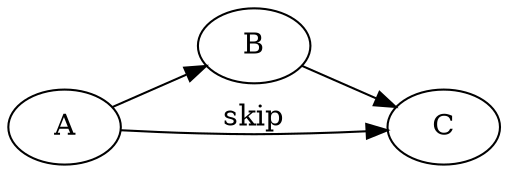
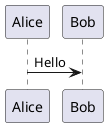

# Diagrams

Inline math $E = mc^2$ and a block:

$$
\int_0^1 x^2 \, dx = \frac{1}{3}
$$

## Graphviz



## Flowchart

```flowchart
st=>start: Start
op=>operation: Work
cond=>condition: OK?
e=>end: End
st->op->cond
cond(yes)->e
cond(no)->op
```

## ECharts

```echarts
{
  // comments and unquoted keys are fine
  xAxis: { type: 'category', data: ['Mon', 'Tue', 'Wed'] },
  yAxis: { type: 'value' },
  series: [{ type: 'bar', data: [120, 200, 150], }],
}
```

## Mind map

```mindmap
- Project
  - Design
    - UI
    - API
  - Test
```

## Markmap

```markmap
# Root
## Branch A
- leaf 1
- leaf 2
## Branch B
```

## ABC

```abc
X:1
T:Scale
M:4/4
K:C
CDEF GABc|
```

## SMILES

```smiles
CC(=O)Oc1ccccc1C(=O)O
```

## PlantUML


