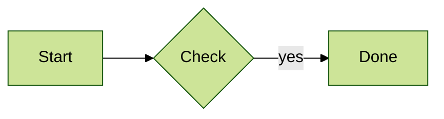
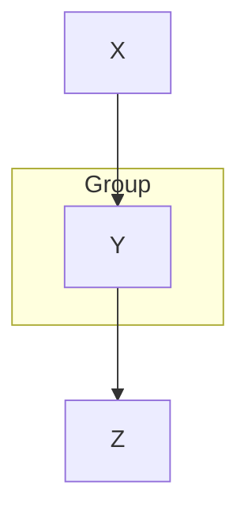

# MD Studio sample

* bullet with star
* another   item

1) first
2) second

Paragraph with **bold**, _emphasis_ and `code`.  
Hard break above. Link to [section 3.7](#37-mermaid-with-frontmatter) and [Japanese](#日本語の見出し).

|Name|Value|
|:-|-:|
|alpha|1|
|beta|22|


## 3.7 Mermaid with frontmatter



## Mermaid default



## 日本語の見出し

```js
const x = 1; // highlighted
```

## Duplicate
## Duplicate

Term with trailing spaces   
Last line without newline